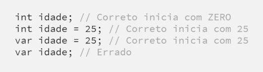
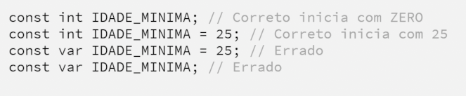
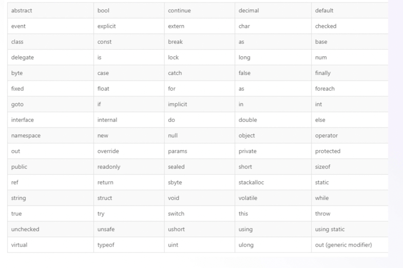

# Anotações
### O C# é case sensitive
---
### Escopo
- Importações
- Namespace
- Classe
- Método Principal

### Namespace
* Normalmente é o nome da pasta!
* Não pode ter 2 arquivos com mesmo nome

### Using (using)
* É como o import do java
* Fica no topo do arquivo

#### Variável
* Elá pode ser alterado
* Guarda algum valor??SIM
* var ou outra variável de algum tipo
* quando var é obrigatório ter algum valor* 

* Sempre usar nomes coesos
* A primeira letra sempre é minuscula
> Declaração:
> * tipo nome = valor

#### Constantes
* O valor não pode ser alterado
* 

#### Palavra reservada

* EXISTEM MAIS
* Então sempre prestar atenção

#### Comentário
- Uma linha //
- Múltiplas linhas /* */
- XML(Metadata)
  - É para gerar dados sobre a classe!

#### Tipos primitivos
* Os que não são primitivos são complexos
* Classificação:
  * Tipos Simples
  * Enumerados
  * Estruturas
  * Tipos Nulos
* Cada tipo possui uma capacidade

## System
* É igual o object em java!
* Muito importante
* O uso dele é implícito

> Bytes:
> * byte 0 até 255 (não pode trabalhar com números negativos)
> * sbyte -128 até 128 - signed

> Números Inteiros
> * Tipos **unsigned é para trabalhar com negativos**
> * short/short
> * int/uint
> * long/ulong

> Números Reais - se usar a opçaão float ou decimal é obrigado usar as anotações
* float F
* double
* decimal M 

> Boolean = bool 
> * Para verdadeiro ou falso
> * true or false

> Char - Para um caracter (Não é muito usado)
> * char = '' (È OBRIGATORIO SER AS ASPAS SIMPLES)

> string - Para texto
> * string = "" (È OBRIGATORIO SER AS ASPAS DUPLAS)

> var - O tipo dele é o primeiro tipo associado a ele!
* var = ?Tipo atribuido

> Object!
> * Ele é qualquer coisa (Não deve ser tão usado)

### Nullabel Types
* null or void = vazio
* void é para metodos
* null para atributos

* Podemos atribuir null a objetos
* se for como null por padrão tem que ter a ? na frente do tipo!

## Alias 
* È apelido para tipos
* Já que todos são classes (Já é o tipo wrappers do Java)
* Muito facilitador

#### Valores padrões

## Conversão:
> **(Implicita)**
* Tem que ser numero inteiro se encaixa em um numero real(Ponto flutuante)
* O contrario não da certo
* A implicita só ocorre quando 

> **(Explicitas)**
* Essa tem que informar o tipo que estamos convertendo
* Fazer quando o tipo que queremos converter não pode ser feito de forma implicita
* Exemplo int para float ou uint
* Evitar um pouco usar
* Sempre é melhor fazer de forma implicita kk

#### Parse:
* Tenta converter uma string para int 

#### Convert
* É uma classe
* È da mesma forma do parse mas não é tao bom usar!

### Operadores Aritimetricos

### Operadores de Atribuição

### Operadores de Comparação
* Sempre vai retornar um booleano verdadeiro ou falso TRUE OR FALSE

### Operadores Logicos
